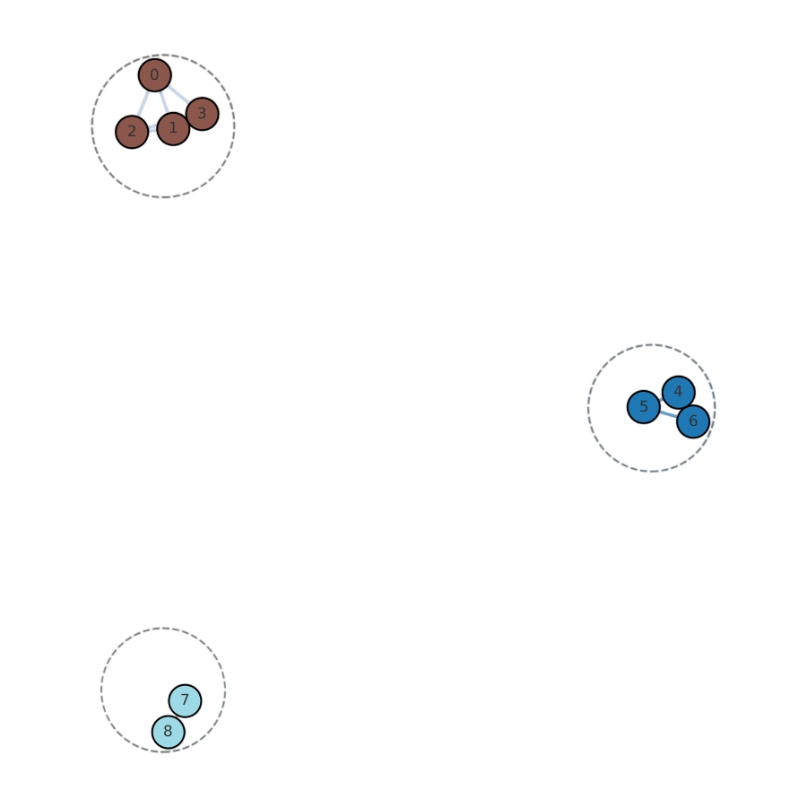

<div align="center">
    
  
  <strong>Python Multi-Objective Community Detection Algorithms</strong>  

[](https://github.com/oliveira-sh/pymocd/actions/workflows/release.yml)


</div>

**pymocd** is a Python library, powered by a Rust backend, for performing efficient multi-objective evolutionary community detection in complex networks. This library is designed to deliver enhanced performance compared to traditional methods, making it particularly well-suited for analyzing large-scale graphs.

**Navigate the [Documentation](https://www.google.com/search?q=https://oliveira-sh.github.io/pymocd/) for detailed guidance and usage instructions.**

## Table of Contents
- [Understanding Community Detection with HP-MOCD](#understanding-community-detection-with-hp-mocd)
- [Getting Started](#getting-started)
  - [Key Features](#key-features)
- [Contributing](#contributing)
- [Citation](#citation)

---

### Understanding Community Detection with HP-MOCD

The `HP-MOCD` algorithm, central to `pymocd`, identifies community structures within a graph. It proposes a solution by grouping nodes into distinct communities, as illustrated below:

| Original Graph                         | Proposed Community Structure             |
| :------------------------------------: | :--------------------------------------: |
|             |            |

### Getting Started

Install the library by pip interface:

```bash
pip install pymocd
```

For an easy usage:

```python
import networkx
import pymocd

G = network.Graph() # Your graph
alg = pymocd.HpMocd(G)
communities = alg.run()
```
Refer to the official **[Documentation](https://oliveira-sh.github.io/pymocd/)** for detailed instructions and more usage examples.

### Contributing

We welcome contributions to `pymocd`\! If you have ideas for new features, bug fixes, or other improvements, please feel free to open an issue or submit a pull request. This project is licensed under the **GPL-3.0 or later**.

---

### Citation

If you use `pymocd` or the `HP-MOCD` algorithm in your research, please cite the following paper:

```bibtex
@article{santos2025hpmocd,
  author    = {Guilherme O. Santos, Lucas S. Vieira, Giulio Rossetti, Carlos H. G. Ferreira and Gladston J. P. Moreira},
  title     = {HP-MOCD: A High-Performance Multi-Objective Community Detection Algorithm for Large-Scale Networks},
  journal   = {The 17th International Conference on Advances in Social Networks Analysis and Mining},
  year      = {2025},
  volume    = {X},
  number    = {X},
  pages     = {XX--XX},
  doi       = {XX.XXXX/XXXXXX},
  abstract  = {Community detection in social networks has traditionally been approached as a single-objective optimization problem, with various heuristics targeting specific community-defining metrics. However, this approach often proves inadequate for capturing the multifaceted nature of communities. We introduce HP-MOCD, a fully parallelized, evolutionary high-performance multi-objective community detection algorithm designed specifically for large-scale networks. Our implementation overcomes the computational challenges that typically limit multi-objective approaches in this domain. While performance may decrease with networks containing high proportions of inter-community edges, extensive evaluations on synthetic datasets demonstrate that HP-MOCD achieves an exceptional balance between scalability and detection accuracy. Available as open-source software, HP-MOCD offers researchers and practitioners a practical, powerful solution for complex network analysis, particularly for applications requiring both efficiency and detection quality.},
  keywords  = {community detection, complex networks, evolutionary algorithms, genetic algorithms, multi-objective},
  note      = {Currently under analysis by the journal}
}
```